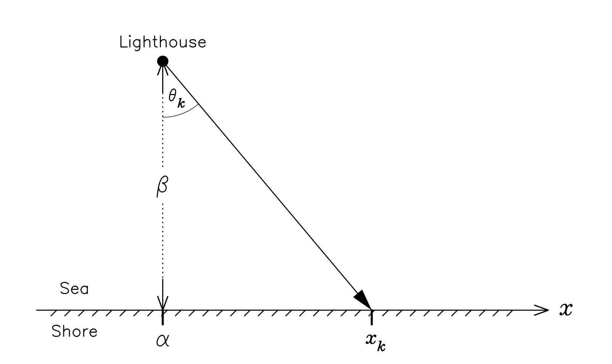
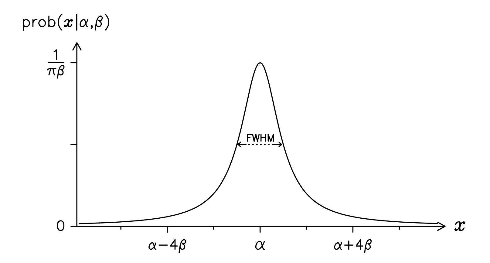

This example comes from 'Data analysis: a Bayesian tutorial'[1 P29]. It was originally studied by Gull (1988) who found this problem on a problems sheet for first-year undergraduates at Cambridge: 'A lighthouse is somewhere off a piece of straight coastline at a position $\alpha$ along the shore and a distance $\beta$ out at sea. It emits a series of short highly collimated flashes at random intervals and hence at random azimuths. These pulses are intercepted on the coast by photo-detectors that record only the fact that a flash has occurred, but not the angle from which it came. $N$ flashes have so far been recorded at positions $x_k$. Where is the lighthouse?'

<div class="centered" style="width:600px; height=400px">

</div>

The geometry of this problem is illustrated above. Give the nature of the lighthouse emissions, it's reasonable to assign a uniform pdf for the azimuth of the $k$th datum $\theta_k$:

$$
p(\theta_k | \alpha, \beta) = \frac{1}{\pi}
$$
Then we can connect the azimuth to the position along the coast $x$ as follow:

$$
\beta \tan\theta = x-\alpha
$$
Note that this is also true for $(x_k, \theta_k)$. Differentiating both side with respect to $x$, we have: 

$$
\beta \sec^2\theta \times\frac{d\theta}{d x} = 1
$$
Using the fact that $\tan^2\theta+1 \equiv \sec^2\theta$, the above equation can be written as: 

$$
\frac{d\theta}{dx} = \bigg(\beta[1+\sec^2\theta]\bigg)^{-1} = \bigg(\beta \big[1+\big(\frac{x-\alpha}{\beta}\big)^2 \big]\bigg)^{-1} = \frac{\beta}{\beta^2+(x-\alpha)^2}
$$
With the subject of changing variables $p(X)=p(Y) \times \bigg|\frac{dY}{dX} \bigg|$[2], we can transform the pdf for $ \theta $ to its equivalent form in terms of $x$. And finally we obtain the Cauchy distribution: 

$$
p(x|\alpha, \beta) = p(\theta| \alpha, \beta) \times \bigg|\frac{d \theta}{dx} \bigg| = \frac{\beta}{\pi \big[\beta^2+(x-\alpha)^2 \big]}
$$

<div class="centered" style="width:600px; height=400px">

</div>

This tells us that the $k$th flash will be recorded at position $x_k$ knowing the location of the lighthouse $(\alpha, \beta)$, is given by a Cauchy distribution. Inferring the position of the lighthouse from the data involves the estimation of both $\alpha$ and $\beta$. For convenience, we just assume that the distance out to sea $\beta$ is known and reduce it to a single parameter example. Our inference about the position of the lighthouse is then expressed by the posterior pdf: 
$$
p\big(\alpha | \{x_k\}, \beta \big) \propto p\big( \{x_k\} | \alpha, \beta \big) \times p\big( \alpha | \beta \big)
$$
Next let us assign a simple uniform pdf for the prior of $\alpha$:
$$p\big( \alpha| \beta \big) = p\big( \alpha \big) = A*I[\alpha_{min} \le \alpha \le \alpha_{max}]$$


,where $I$ is the indicator function and $\alpha_{min}$ and $\alpha_{max}$ could represent the limits of the coastline, if these were known, or be made arbitrarily large. Since the recording of a signal at one photo-detector does not influence what we can infer about the position of another measurement (when given the location of the lighthouse), the likelihood function for these independent data is just the product of the probabilities for obtaining the N individual detections:
$$
p\big(\{x_k\} | \alpha, \beta \big) = \prod^N_{k=1} p\big(x_k | \alpha, \beta \big)
$$
Substituting the prior of $\alpha$ and this likelihood function, we can get the logarithm of the posterior distribution: 
$$
L = Log_e \big[ p\big(\alpha \big| \{x_k\}, \beta \big) \big] = constant - \sum^N_{k=1}log_e\big[ \beta^2+(x_k-\alpha)^2 \big]
$$
where the constant includes all terms not involving $alpha$. Sometimes you need to be careful about the $\alpha$ inside the indicator function. In this case, let's just assume that the prior range is so large that we need not worry about any cut-offs imposed on the posterior.

The best estimate of the position $\alpha_0$ is given by the maximum of the posterior pdf. Differentiating this log-posterior pdf once, with respect to $\alpha$, we obtain the condition:
$$
\frac{dL}{d\alpha} \bigg|_{\alpha_0} = 2\sum_{k=1}^N \frac{x_k-\alpha_0}{\beta^2+(x_k-\alpha)^2} = 0
$$
Unfortunately, it is difficult to rearrange this equation so that αo is expressed in terms of $\{ x_k \}$ and $\beta$. Although an analytical solution may confound us, there is nothing to stop us tackling the problem numerically. The most straightforward method is to use brute force and ignorance: simply evaluate $L$, the log posterior pdf, for a whole series of different possible values of $\alpha$ the number giving rise to the largest $L$ will be the best estimate. If we plot the exponential of $L$, $exp(L)$, on the vertical axis, as a function of $\alpha$, on the horizontal axis, then we obtain the posterior pdf for the position of the lighthouse. Not only does this give us a complete visual representation of our inference, it has the advantage that we don’t need to worry whether the posterior pdf is asymmetric or multimodal.

```{r}
set.seed(213)
n = 2
theta = runif(n, -pi/2, pi/2)
beta = 1
alpha = 1.1
x = beta*tan(theta) + alpha
# x = rcauchy(512, location=alpha, scale=beta)

seqA = seq(-5, 5, 0.1)
la = c()
for(a in seqA){
    la = c(la, -sum(log(  beta^2+(x-a)^2)  ))
}

plot(x=seqA, y=la, type="l")
abline(v=mean(x), col="red")
```


[1]: Sivia, Devinderjit, and John Skilling. Data analysis: a Bayesian tutorial. OUP Oxford, 2006.
[2]: "https://en.wikipedia.org/wiki/Probability_density_function" -- Dependent variables and change of variables


