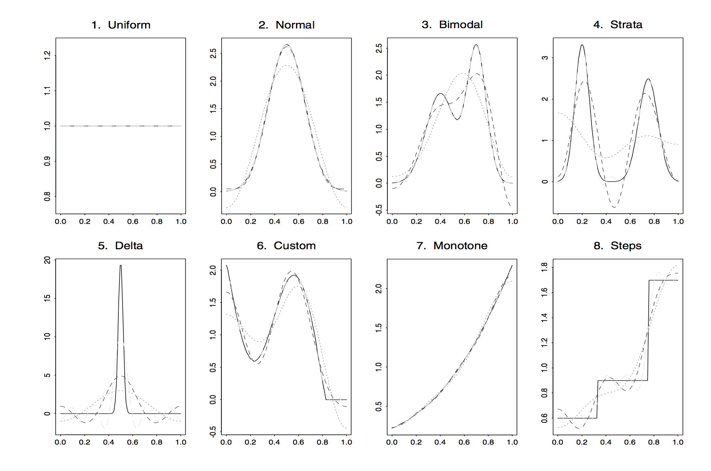

### 1. Semi-Supervised Learning (SSL)
Semi-supervised learning uses both labeled and unlabeled data.[4] That is the learner has both labeled training data $\{(\textbf{x}_i,z_i) : i=1,2,\dots,n \}$ and unlabeled training data $\{\textbf{x}_i : i=n+1,\dots,n+p \}$, where $\textbf{x}_i$ is a multidimensional vector and $z_i$ is a scalar.  The goal is to learn a predictor that predicts $z$ given the new test data $\textbf{x}$. Or in other words, we want to find a mapping $\varphi: \textbf{X} \rightarrow \textbf{z}$ that maps the input space $\textbf{X}$ to the value space $\textbf{z}$. The problem is unlabeled data $\{\textbf{x}_i : i=n+1,\dots,n+p \}$ by itself does not carry any information on the mapping $\varphi: \textbf{X} \rightarrow \textbf{z}$, so how can it help us learn a better predictor? 

<!-- more -->

Self-training, starting in the 1960s, might be the oldest approach to semi-supervised learning. Generative models introduced by Vladimir Vapnik in the 1970s are also very popular approach to semi-supervised learning. But these methods cannot give a very detailed answer to the question above. Here I would like to introduce an example of the semi-supervised learning method, which is a nonparametric series approach proposed by Izbicki and Lee. This series framework can be naturally extended to semi-supervised learning (Zhu and Goldberg 2009). And they also provided the converge rate with and without the unlabeled data.

### 2. Nonparametric Spectral Series Estimator for Conditional Density
Rafael IZBICKI and Ann B. LEE[2] propose a new nonparametric series estimator to estimate the condition density of $z$ given $\textbf{x}$. Their method follows the following steps: first use the eigenfunctions of an special defined integral operator as the basis of $\textbf{x}$. We can see that these eigenfunctions are orthonormal with respect to the data distribution $P(\textbf{x})$. Then choose a suitable orthonormal basis on the domain of $z$. After that they define a specral series to be the estimate of the conditional density $f(z|\textbf{x})$.

In the first step, the estimator of the spectral basis on the domain of $\textbf{x}$ depends only on $\textbf{x}$ and has nothing to do with $z$. So in this case, ***By including the unlabeled data in the first step, we can better estimate the eigenfunctions which form the basis on the domain of $\textbf{x}$, and hence the conditional density.***

Section 3 describes the triditional series estimators in both univariate and multivariate case. In section 4, we talk about this spectral series method. 

### 3. Introduction to Series Estimator[3; Chapter 2, 3 and 6]
#### 3.1 Orthonormal Basis (Univariate Case) [3; Chapter 2]
For a given function $f(x)$, we can describe it via a series expansion. Suppose the domain of $f(x)$ is $[0,1]$. Then 
$$f(x)=\sum_{j=0}^{\infty}\theta_j\varphi_j(x), \ \textrm{where}\ \theta_j = \int_0^1 f(x)\varphi_j(x) dx$$
Here the functions $\varphi_j(x)$ are called $orthonormal\ functions$, and the $\theta_j$ are called the $Fourier$ coefficients. A system of functions is called $orthonormal$ if the integral $\int_0^1 \varphi_s(x)\varphi_j(x) dx = 0$ for all $s \ne j$ and $\int_0^1 (\varphi_j(x))^2 dx = 1$ for all $j$. 
However, describe a function via an infinite orthogonal series expansion workable. Instead, a truncated (finite) orthonormal series
$$f(x)=\sum_{j=0}^{J}\theta_j\varphi_j(x)$$
is used to approximate $f$. The integer parameter $J$ is called the cutoff.
For example, it is very easy to show that the 'Cosine system' is an orthonormal system on $[0, 1]$. The elements in Cosine system are:
$$\varphi_0(x)=1 \ \textrm{and}\ \varphi_j=\sqrt{2} \cos(\pi jx) \ \ \textrm{for} \ \ j=1,2,\dots$$

This plot comes from [3, P22]. It shows the approximation of eight corner functions (solid lines) by cosine series: dotted, short-dashed, and long-dashed lines correspond to cutoffs $J = 3$, $J = 5$, and $J = 10$, respectively.

#### 3.2 Tensor Product (Multivariate Case)  [3; Chapter 6]
The approximation methods discussed above can be extended to multivariate case using the so-called 'tensor–product basis' which makes the problem of series approximation of multivariate functions similar to the univariate case. In this post, we only focus on the case of bivariate functions. Multivariate functions can be treated with this method similarly. 

Denote by $L(A \times B)$ the space of square integrable bivariate functions $f(x,y)$ such that $\int_A \int_B f^2\big(x, y\big)dxdy < \infty$.  

Let $\{ \phi_n(x), n=0,1,2,\dots \}$ and $\{ \psi_m(y), n=0,1,2,\dots \}$ be two bases in the one-dimensional spaces $L_2(A)$ and $L_2(B)$. Then products of elements from these two bases,  

$$\{ \varphi_{nm}(x, y) =  \phi_n(x)  \psi_m(y),\ n,m=0,1,\dots \}$$  
constitute a basis in $L_2(A \times B)$. This basis is called the tensor-product basis. 

For example, the cosine tensor-product basis in $L_2([0,1]^2)$ has the elements:  
$$
\varphi_{00}(x, y)=1, \varphi_{01}(x,y)=\sqrt2\cos(\pi y), \varphi_{02}(x,y)=\sqrt2\cos(2\pi y), \dots \\
\varphi_{10}(x, y)=\sqrt2\cos(\pi x), \varphi_{11}(x,y)=2\cos(\pi x)\cos(\pi y), \dots
$$
And a corresponding partial sum with cutoffs $J_1$ and $J_2$ relative to the variables $x$ and $y$ is:   
$$f_{J_1, J_2}(x,y)=\sum_{j_1=0}^{J_1} \sum_{j_2=0}^{J_2} \theta_{j_1j_2} \varphi_{j_1j_2} (x,y)$$    
where the Fourier coefficients $\theta_{j_1j_2}$ are defined by the formula:    
$$\theta_{j_1j_2} = \int_0^1 \int_0^1 f(x,y) \varphi_{j_1j_2} dxdy$$
#### 3.3 Density Estimation [3; Chapter 3]
If $f$ is the probability density, the choice of an estimate for Fourier coefficients is straightforward. Indeed, the coefficient $\theta_j$ may be written as 
$$\theta_j = E[I_{X\in[0,1]} \varphi_j(x)]$$
And the natural estimate of the theoretical mean is the sample mean,   
$$\hat{\theta_j}=n^{-1}\sum_{l=1}^nI_{X_l\in[0,1]} \varphi_j(X_l)$$

### 4. Spectral Series Estimator
#### 4.1 Introduction

#### 4.2 Algorithm

#### 4.3 Discuss

[1] https://en.wikipedia.org/wiki/Semi-supervised_learning

[2] Izbicki, Rafael, and Ann B. Lee. "Nonparametric Conditional Density Estimation in a High-Dimensional Regression Setting." Journal of Computational and Graphical Statistics,(just accepted) (2015).

[3] Efromovich S. Nonparametric curve estimation: methods, theory, and applications[M]. Springer Science & Business Media, 2008.

[4] Zhu, Xiaojin. "Semi-supervised learning." Encyclopedia of Machine Learning. Springer US, 2011. 892-897.